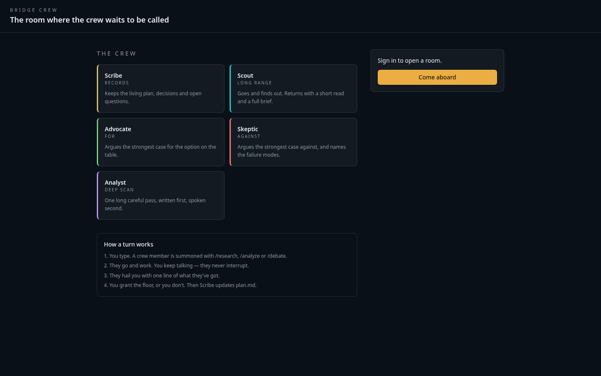
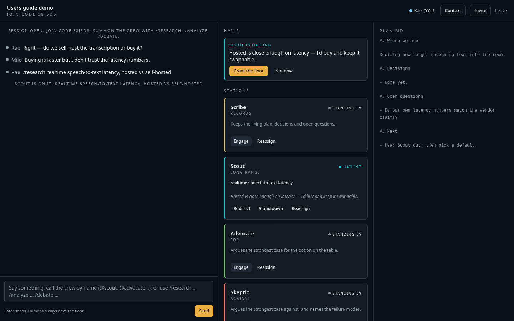
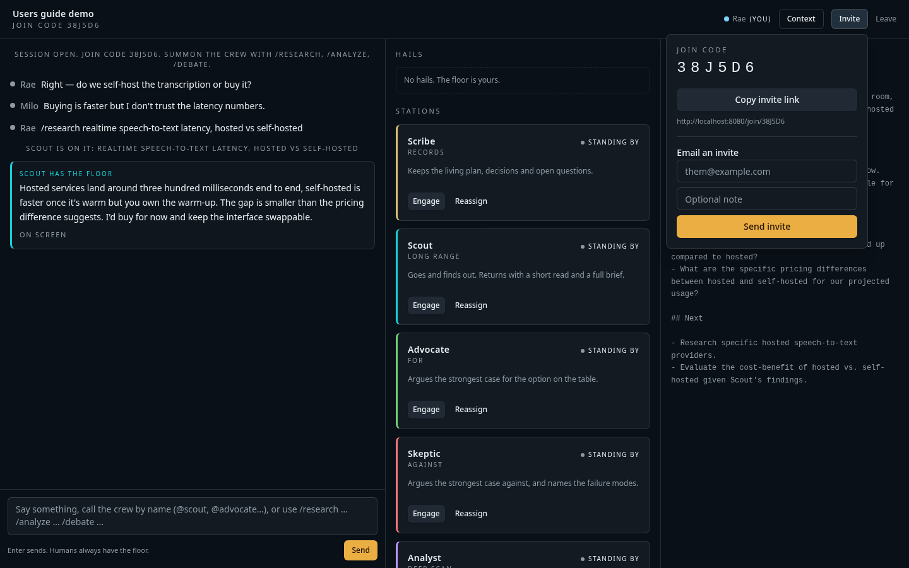
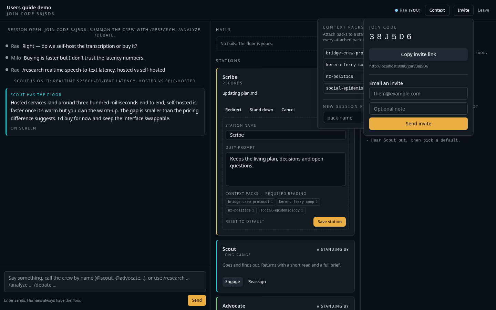
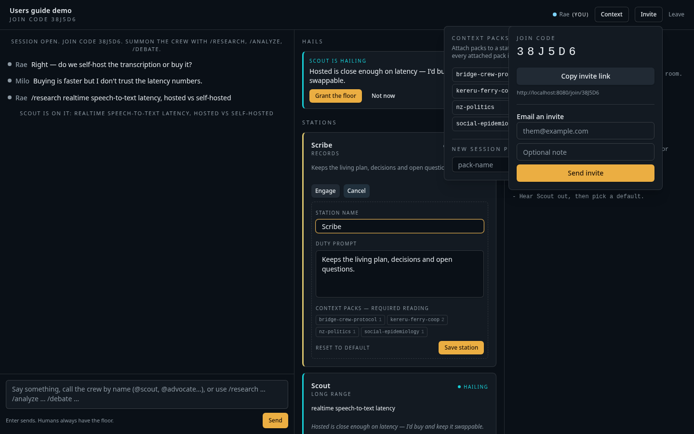
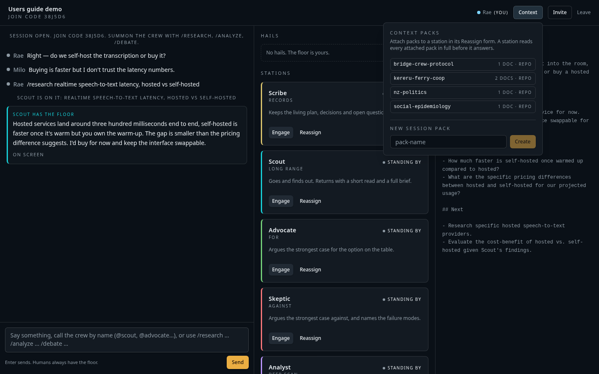

# Bridge Crew — users guide

A short, practical walkthrough. Bridge Crew is a shared room where **the humans** type,
**the agents** work in the background, and nobody speaks until a human grants the floor.

---

## 1. Sign in

Open the app and choose **Come aboard**. Sign up with email and password (confirm the link
in your inbox — check spam the first time) or use Google. You land in the lobby.

The lobby shows the crew roster, a form to open a room, a join-by-code box, and your recent
rooms.

## 2. Open a room

1. Type **your name in the room** (this is what the other human sees next to your colour dot).
2. Pick a colour.
3. Give the session a **title**.
4. Press **Open a room** — or **Open a demo room** to get a pre-filled example (see §9).

You are dropped straight into the room and the header shows the **join code**.

The room has three columns:

| Column | What it is |
| --- | --- |
| Left | The conversation and your message box |
| Middle | **Hails** (agents asking to speak) and the **stations** |
| Right | `plan.md`, the living document the Scribe maintains |

## 3. Invite the second human

Click **Invite** in the header. You can:

- **Copy invite link** — a `/join/<CODE>` URL you paste into any chat, or
- **Email an invite** — enter their address plus an optional note.

The other person signs in, picks their own name and colour, and joins the same room.
They can also type the six-character code into the lobby's **Join with a code** box.

## 4. Talk

Type in the box at the bottom left and press **Enter** (Shift+Enter for a new line).
Everything you and the other human say is visible immediately to both of you and is read by
every agent you summon afterwards.

## 5. Summon the crew

Three ways, all equivalent:

**Slash commands**

| Command | Effect |
| --- | --- |
| `/research <topic>` | Sends Scout to go and find out |
| `/analyze <thing>` | Sends the Analyst for a deep scan |
| `/debate <question>` | Sends Advocate *and* Skeptic on opposite sides |
| `/scribe <brief>`, `/scout …`, `/advocate …`, `/skeptic …`, `/analyst …` | Summons that one station |
| `/redirect <station> <new brief>` | Replaces what a working station is doing |
| `/stop <station>` | Stands a station down |

**Naming them in ordinary speech** — `@scout, what did the vendor docs actually say?`
re-engages Scout with that line as the brief. Several mentions in one line engage several
stations.

**Station buttons** — each card has **Engage** (or **Redirect** when it's already working),
**Stand down**, and **Reassign**.

Stations move through five statuses: `standing by` → `working` → `hailing` → `has the floor`,
plus `stood down`. Only one station can hold the floor at a time. The full state machine is in
[floor_state_control.md](floor_state_control.md).

## 6. Grant the floor

When an agent has something, it raises a hand and one line of what it's got appears under
**Hails**. Nothing is said in the room until you press **Grant the floor** — or **Not now** to
dismiss it.

A granted turn is short (capped at ten sentences). Anything longer goes into the written
brief: press **On screen** under the agent's line to read it, **Clear screen** to fold it away.

Either human can grant or dismiss any hail. A human typing always preempts a speaking agent.

## 7. Reassign a station

Press **Reassign** on any card to change:

- **Station name** — e.g. rename Scribe to `Bug_Reporter`
- **Duty prompt** — what that station is for, in your words
- **Context packs** — required reading (see §8)

Save with **Save station**, or use **Reset to default** to put the stock crew member back.
Changes apply to the next run and are visible to both humans.

## 8. Context packs

A context pack is a named folder of documents a station must read **in full** before it
answers. Open **Context** in the header to see what's available.

- **Repo packs** ship with the app: `bridge-crew-protocol`, `kereru-ferry-coop`,
  `nz-politics`, `social-epidemiology`. They contain deliberately obscure facts, so you can
  tell from an answer whether the pack was actually read.
- **Session packs** are created here and live only in this session.

Attach packs to a station in that station's **Reassign** form; attached packs show as chips on
the card. Every run, an agent receives: its duty, the conversation so far, the current
`plan.md`, and every attached pack.

## 9. Demo mode

**Open a demo room** in the lobby creates a normal room pre-loaded with a short scripted
scene: two humans debating hosted vs. self-hosted speech-to-text, a `/research` summon, a
Scout hail waiting for you, and a starter `plan.md`.

**What works in a demo room** — everything a normal room does:

- Granting the floor to the pre-loaded Scout hail (Scout speaks, Scribe then updates `plan.md`)
- Typing, summoning, redirecting and standing down stations, with live model answers
- Reassigning stations, attaching context packs, creating session packs
- Inviting a second human by link, code, or email
- Real-time sync between both humans' browsers

**What is not real in a demo room:**

- The opening four lines and Scout's first contribution are **canned text**, not model output —
  "Rae" and "Milo" are not real participants and never reply
- The pre-loaded hail's brief was written by hand, so it cites no live sources
- The seeded `plan.md` was written by hand, not by the Scribe (the Scribe overwrites it on its
  next run)
- No context pack was read for that first canned answer

Everything you do *after* opening the demo room is real. To start clean, leave and use
**Open a room** instead.

## 10. Leaving and coming back

**Leave** returns you to the lobby; the room keeps its state. Your recent rooms are listed in
the lobby sidebar — reopen one and the whole conversation, stations, and plan are as you left
them.

## Not built yet

Voice and video, session export bundles, and agent tool use are on the plan
([BRIDGE_CREW_PLAN.md](plans/BRIDGE_CREW_PLAN.md)) but not in the app today. Everything above
is text-first.
